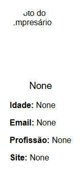

# Projeto Docker: Cartão de Visitas (card-business) - Python/Flask

### 1 - O que é?

Cartão de visitas web desenvolvido em Python com Flask com intuito educacional.

**1.2 - O que é Docker?**

- O Docker usa uma arquitetura cliente-servidor.
- Com o Docker, você pode gerenciar sua infraestrutura da mesma forma que gerencia seus aplicativos. Ao aproveitar as metodologias do Docker para enviar, testar e implantar código, você pode reduzir significativamente o atraso entre escrever o código e executá-lo na produção.

**1.3 - Estados do Card**

<div style="display: flex; justify-content:space-between;">

 
default
 
container
</div>

### 2 - Pré-requisitos

- Python 
- Pip
- Flask

**disclaimer: 'recomendo a versão 11 do python, ultimamente a mais estável'**

**2.1 - Instalação dos pré-requisitos (Exemplo: GNU/Linux Debian 11)**

1. Atualize os repositórios com `sudo apt update`
2. Instale os pacotes `sudo apt install python3.11 python3.11-dev python3.11-venv python3-pip -y`
3. Atualize o pip com `sudo pip3 install --upgrade pip`

### 3 - Configurando variáveis de ambiente

O projeto trabalha com algumas variáveis de ambientes para definir valores presentes no cartão web, são elas:

- FOTO
- NOME
- IDADE
- EMAIL
- PROFISSAO
- SITE

Exporte-as para aplicar seus valores.
Você pode defini-las em algum local de sua preferência de modo que sejam carregadas no sistema.

**3.1 - Exportando Variáveis de Ambiente**

Adicione o trecho abaixo ao `/etc/profile`, por exemplo:

```bash
export FOTO='DEFINA UM VALOR'
export NOME='DEFINA UM VALOR'
export IDADE='DEFINA UM VALOR'
export EMAIL='DEFINA UM VALOR'
export PROFISSAO='DEFINA UM VALOR'
export SITE='DEFINA UM VALOR'
```

E aplique suas configurações com `source /etc/profile`

### 4 - Como executar (Exemplo: GNU/Linux Debian 11)?

**Crie um ambiente virtual**

1. Entre no diretório do projeto e execute `python3 -m venv venv`
2. Ative o ambiente virtual com `source venv/bin/activate`
3. Instale as dependências com `pip install --no-cache-dir -r requirements.txt`

**Execute o projeto**

1. Execute com `python app.py`

**4.1 - Executando com Docker**

1. Entre no diretório do projeto e execute `docker build -t <nome da imagem>:<tag> .`
2. Apos o build execute o comando `docker run -it -p <porta personalizada> <nome da imagem>:<tag>`

### 5 - Como Acessar?

Com a aplicação em execução abra o navegador em `localhost:8080`
